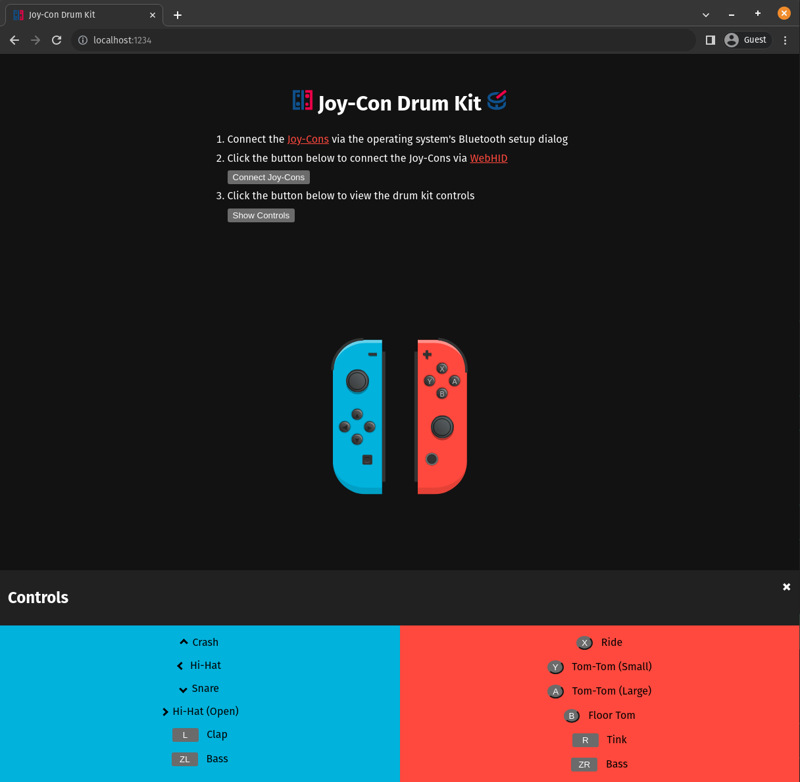

# Joy-Con Drum Kit

A simple web app that uses `Joy-Con`s as drum kit controllers (connected via [WebHID](https://web.dev/hid)).

> [!NOTE]
> WebHID is currently only supported on Chromium-based browsers e.g. Chrome, Edge, etc.

## Demo



## Pre-requisites

If you are running __Linux__, you need to perform the following steps.

1. Create a new file `/etc/udev/rules.d/10-joycon.rules` and paste the following content:

    ```sh
    # Switch Joy-con (L) (Bluetooth only)
    KERNEL=="hidraw*", SUBSYSTEM=="hidraw", KERNELS=="0005:057E:2006.*", MODE="0666"

    # Switch Joy-con (R) (Bluetooth only)
    KERNEL=="hidraw*", SUBSYSTEM=="hidraw", KERNELS=="0005:057E:2007.*", MODE="0666"

    # Switch Pro controller (USB and Bluetooth)
    KERNEL=="hidraw*", SUBSYSTEM=="hidraw", ATTRS{idVendor}=="057e", ATTRS{idProduct}=="2009", MODE="0666"
    KERNEL=="hidraw*", SUBSYSTEM=="hidraw", KERNELS=="0005:057E:2009.*", MODE="0666"

    # Switch Joy-con charging grip (USB only)
    KERNEL=="hidraw*", SUBSYSTEM=="hidraw", ATTRS{idVendor}=="057e", ATTRS{idProduct}=="200e", MODE="0666"
    ```

2. Reload `udev` rules using `sudo udevadm control --reload-rules`

## Quickstart

Launch the app locally with `npm run dev`.

## Attribution

- [Joy-Con WebHID](https://github.com/tomayac/joy-con-webhid) Driver
- Joy-Con models by [Stix](https://codepen.io/stix/details/WRoweX#input_1604658346501:~:text=License)
- Icons by [Icons8](https://icons8.com)

### TODO

- [ ] Configure CI/CD with GitHub actions
- [ ] Deploy app