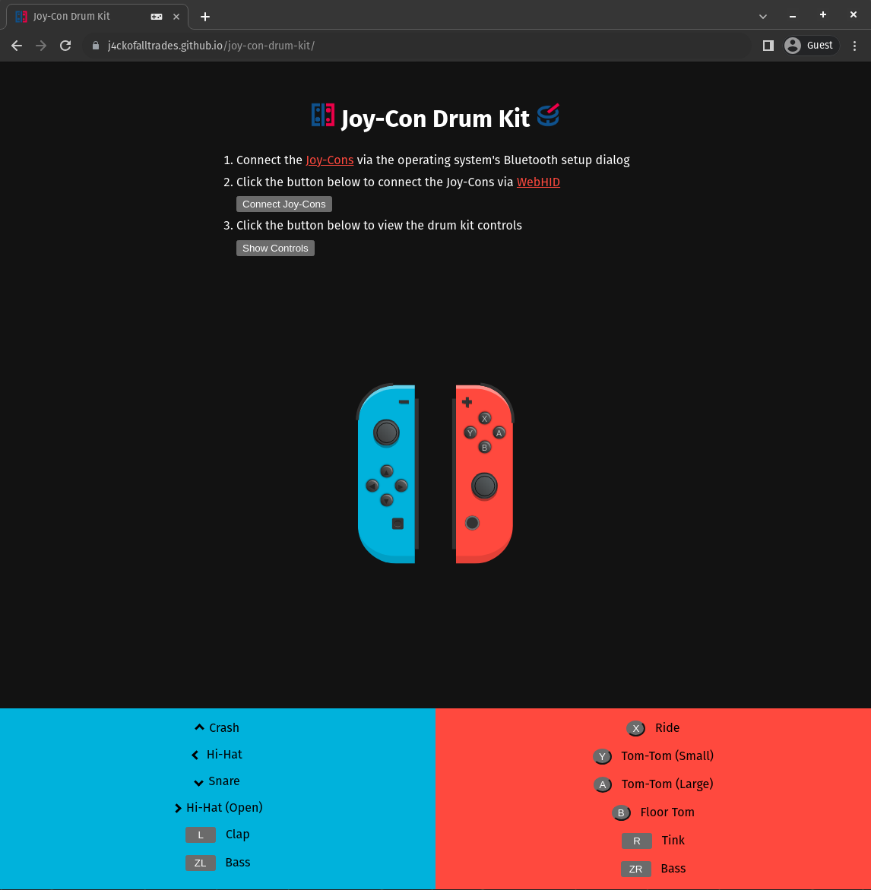

# Joy-Con Drum Kit

A drum kit web app that uses Nintendo Joy-Cons as controllers (connected via [WebHID](https://web.dev/hid)).

> [!IMPORTANT]
> The WebHID API is currently only supported on [Chromium-based browsers](https://developer.mozilla.org/en-US/docs/Web/API/WebHID_API#browser_compatibility) e.g. Chrome, Edge, etc.

## Demo

Check out the live demo of the app [here](https://j4ckofalltrades.github.io/joy-con-drum-kit/).



You can also view a demo recording by clicking on the video below:

[](https://www.youtube.com/watch?v=pzw6PiM772w)

## Pre-requisites

If you are running __Linux__, you need to perform the following steps.

1. Create a new file `/etc/udev/rules.d/10-joycon.rules` and paste the following content:

    ```sh
    # Switch Joy-con (L) (Bluetooth only)
    KERNEL=="hidraw*", SUBSYSTEM=="hidraw", KERNELS=="0005:057E:2006.*", MODE="0666"

    # Switch Joy-con (R) (Bluetooth only)
    KERNEL=="hidraw*", SUBSYSTEM=="hidraw", KERNELS=="0005:057E:2007.*", MODE="0666"
    ```

2. Reload `udev` rules using `sudo udevadm control --reload-rules`

## Quickstart

Launch the app locally with `pnpm install --frozen-lockfile` and `pnpm run start`.

## Attribution

- [Joy-Con WebHID](https://github.com/tomayac/joy-con-webhid) Driver
- Joy-Con models by [Stix](https://codepen.io/stix/details/WRoweX#input_1604658346501:~:text=License)
- Icons by [Icons8](https://icons8.com)
